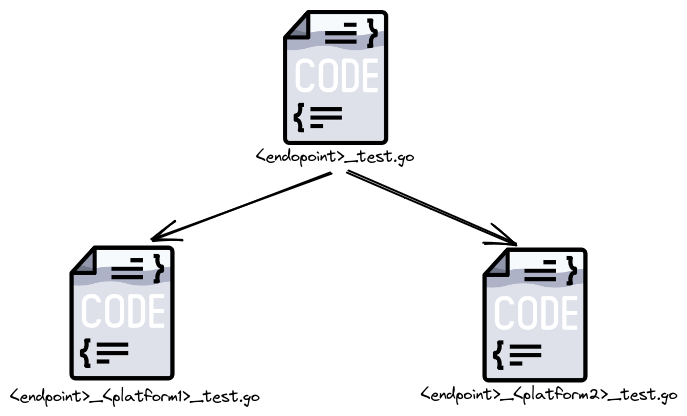

# E2E Tests

This document gives you an overview about **e2e** tests for `host-scanner`.

These tests are made to check `host-scanner` endpoints in different **kubernetes** platforms.

The currently supported platforms are the follows:

* **kind** (local)

## Workflow Overview

The workflows manage the entire test process. Each workflow is dedicated to a specific platform (mostly to test managed and local clusters).

When the single workflow is triggered, then it start setting up the environment with the dedicated platform.

The main steps that each workflow does are described below:

* clone this repository

* setup `go`

* setup `docker` to build the release

* install `kubectl`

* setup the cluster for the given platform (`kind`|`aks`|...)

* install the latest build of `host-scanner`

* setup a local port-forward with `host-scanner`

* run the tests with `ginkgo`


## Test Overview

The tests structure is the following:



For each new endpoint we are testing, we have a dedicated file (eg. `<endpoint>_test.go`) which contains the code with the test.

The other files (eg. `<endpoint>_<platform1>_test.go`, `<endpoint>_<platform2>)test.go`), are used to enable the support for the listed platforms. These files contain the data structures with expected vales for the supported platform, since `host-scanner` can give a different result, depending on the platform is installed on. These strucures must be used inside the main file (eg. `<endpoint>_test.go`), in order to verify the right response from the HTTP requests.

In order to make it possible we use the [*build tags*](https://pkg.go.dev/go/build#hdr-Build_Constraints) functionality provided by `go`. So, for each file that contains platform designed data structures, we have to write the specific build tag that identify the platform itself (eg. `//go:build kind`).

So, to run the tests for a specific provider, you need to run the following command inside `e2e/` directory:

```
go test -tags <provider> -v -ginkgo.v
```

### Write your own test

As described above, in order to implement a test for a new endpoint, we have to do the following steps:

* create a new endpoint file with ginkgo: `ginkgo generate <endpoint>_test.go`

* write the code to test the endpoint (without declare the stucture that you are going to use to compare the expected result)

* create a test file for each platform you want to support for this endpoint.
  
  [Example] if you want to support `kind` and `aks`, you need to create 2 files named like so: `<endpoint>_kind_test.go`, `<endpoint>_aks_test.go`.

  The content should be something like this:

  ```
  //go:build kind
  
  package e2e_test

  import (
	"github.com/kubescape/host-scanner/sensor"
  )

  var dataStructToCompare = sensor.exampleStruct{
    field1: "value1"
    field2: "value2"
    field3: "value3"
  }
  ```

* once created these files, you can fill the platform designed data structures with the expected values.

* run the test against the platforms you are supporting (`kind`, `aks`), giving this command (don't forget to forward connection with `host-scanner`):

    * `go test -tags kind -v -ginkgo.v`

    * `go test -tags aks -v -ginkgo.v`

**N.B.** If you have a local forward on a different port (than `7888`), you can run the command in this way:

```
go test -tags <tag_name> -v -ginkgo.v -args -port <port>
```